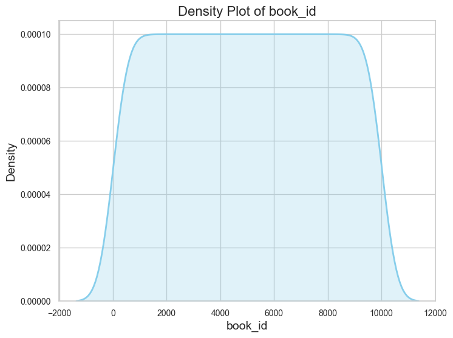
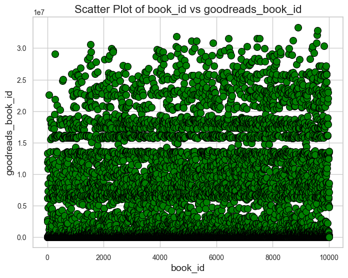
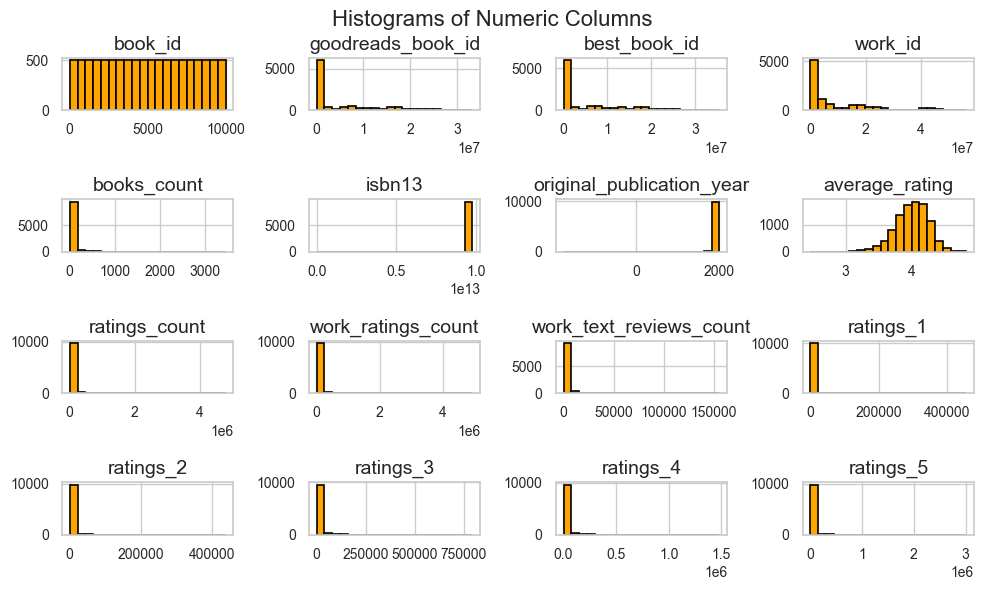
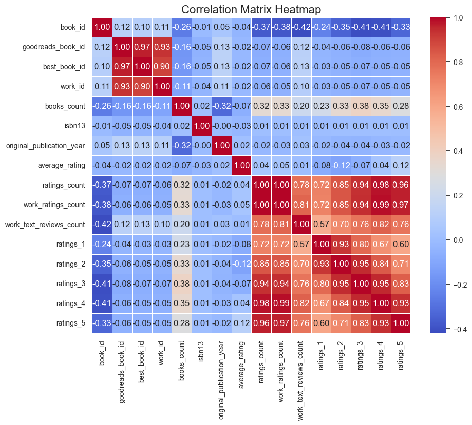

# Automated Data Analysis Report
This report presents a detailed analysis of the dataset, including descriptive statistics, data visualizations, and key insights.

## Insights from Dataset Analysis
### Comprehensive Analysis of the Dataset

#### 1. **Data Quality:**

**Missing Values:**
- **Analysis:** The following columns contain missing values:
  - `isbn`: 700 missing values (7%)
  - `isbn13`: 585 missing values (5.85%)
  - `original_publication_year`: 21 missing values (0.21%)
  - `original_title`: 585 missing values (5.85%)
  - `language_code`: 1084 missing values (10.84%)

- **Patterns:** The missing values appear to be systematic rather than random, particularly for `isbn`, `original_title`, and `language_code`, which may indicate issues in data entry or sourcing.

- **Handling Suggestions:**
  - For `isbn` and `isbn13`, consider using imputation with a mode or leveraging external databases to fill in missing values.
  - For `original_publication_year`, missing years can be filled using the median of the distribution if not critical.
  - For `language_code`, if categorical, use the mode for imputation; otherwise, consider further data collection.
  - For `original_title`, explore if it can be filled based on `title` or potentially drop as it has a high missing percentage.

**Outliers:**
- **Outlier Detection:**
  - `goodreads_book_id`, `best_book_id`, `work_id`, `books_count`, `average_rating`, `ratings_count`, `work_ratings_count`, `work_text_reviews_count`, `ratings_1`, `ratings_2`, `ratings_3`, `ratings_4`, `ratings_5` have notable outliers.

- **Impact on Analysis:** Outliers could skew results, particularly for mean calculations and correlated analyses. 

- **Handling Approaches:**
  - **Capping:** Set upper and lower limits based on percentiles (e.g., 1st and 99th percentiles) for continuous variables.
  - **Transformation:** Consider using log transformation for variables like `ratings_count` to reduce skewness.
  - **Removal:** In extreme cases, where outliers are clearly errors (if any), review and potentially remove them.

**Data Types:**
- **Review:** Ensure numerical values (like `isbn`, `isbn13`) are stored as strings or integers where appropriate; many book-related IDs are better as strings to retain leading zeros.
- **Recommendations:** Convert mismatches like numerical data stored as strings to appropriate numeric types. Validate categorical and date fields for accuracy.

#### 2. **Dataset Summary (Descriptive Statistics):**

**Overview:**
- **Numerical Columns:**
  - Central values (mean, median) for `ratings_count` show a right skew (mean > median).
  - High standard deviation relative to mean in many upper percentile data suggests a diverse range of ratings, reader engagement, and other variables.

- **Categorical Columns:**
  - `language_code` has a variability that may show multilingual books.
  - Look at unique counts for `authors` and `original_title` to understand diversity.

- **Insights:**
  - Variables like `books_count` must have further investigation as they directly influence ratings and user engagement.
  - `work_ratings_count` indicating strong library activity might relate closely to `average_rating`, indicating that higher ratings correspond often with higher volume.

#### 3. **Correlation Matrix:**

- **Variable Relationships:**
  - Strong correlations found between `ratings_count`, `ratings_1`, and `work_ratings_count`. Positive correlations among these ratings suggest that as the volume of ratings increases, so does the positive score in ratings.
  - `books_count` is negatively correlated with all ratings which needs further analysis.

- **Unexpected Findings:**
  - Low correlation between `average_rating` and `ratings_count` indicates that a higher number of ratings does not necessarily correspond to better quality as judged by star ratings. This might require a closer check on the distribution of ratings.

#### 4. **Visualization Analysis:**

1. **Density Plot:**
   - Discuss skewness. If the first numeric column is `ratings_count`, it likely shows right skew. Suggest transformations if statistical modeling is used for these variables.

2. **Scatter Plot:**
   - If `ratings_count` vs. `average_rating` shows linear trends, quantify this correlation but watch for outliers affecting this. Look for clustering as the ratings increase and their count, a good sign of book popularity.

3. **Histogram:**
   - Histogram review can show distributions for skewness. Identify highly skewed variables that might require log transformation.

#### 5. **Recommendations for Further Exploration and Data Cleaning:**

- **Further Exploration:**
  - Examine relationships between `original_publication_year` and `ratings` to check if older books are rated differently.
  - Conduct cohort analysis based on `language_code`
## Visualizations

### 1. Density Plot
This plot shows the distribution of the first numeric column. It helps in understanding the shape of the distribution (e.g., normal, skewed, etc.).

### 2. Scatter Plot
This plot illustrates the relationship between the first two numeric columns. It can show if there is any correlation or a specific trend.

### 3. Histogram
This plot provides a view of the distribution of all numeric columns in the dataset. It is useful to identify data patterns such as skewness or outliers.

### 4. Correlation Heatmap
This heatmap visualizes the correlations between numeric columns in the dataset.

