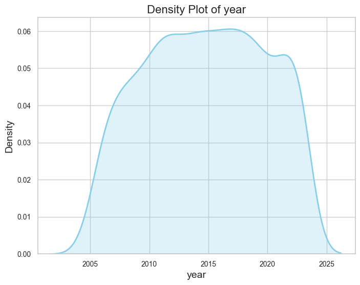
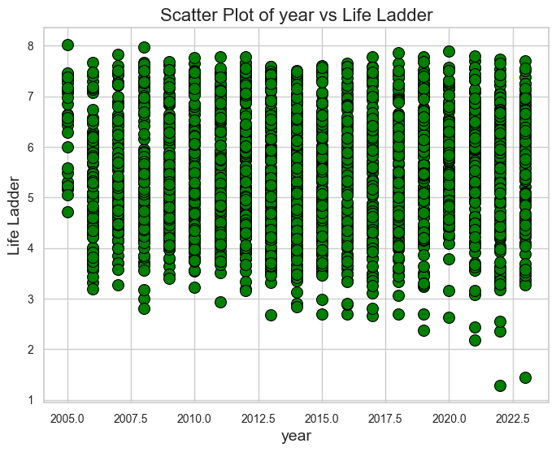
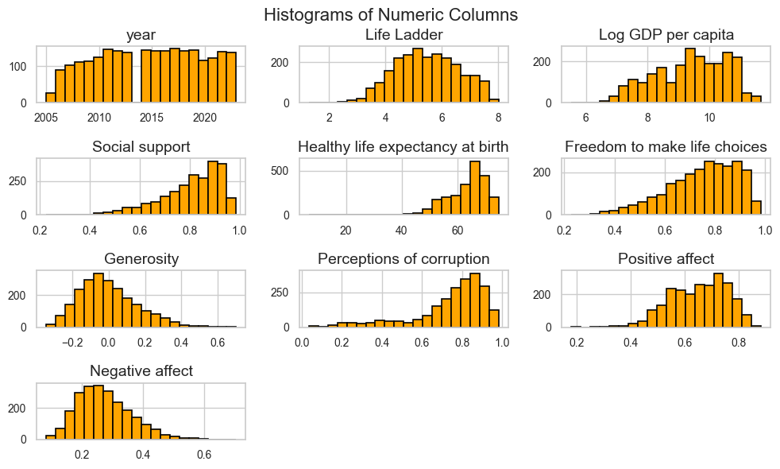
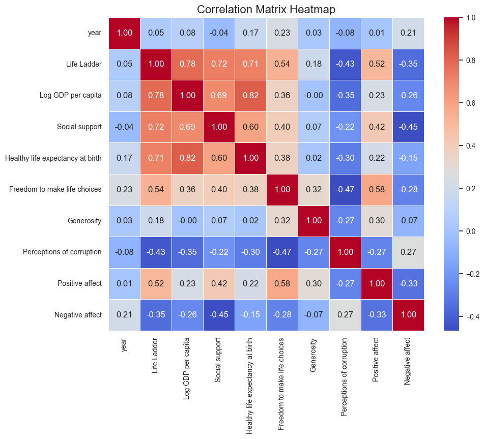

# Automated Data Analysis Report
This report presents a detailed analysis of the dataset, including descriptive statistics, data visualizations, and key insights.

## Insights from Dataset Analysis
## Comprehensive Analysis of the Dataset

### 1. **Data Quality:**

#### **Missing Values:**
- **Columns with Missing Values:**
  - `Log GDP per capita`: 1.18% (28 missing out of 2363)
  - `Social support`: 0.55% (13 missing)
  - `Healthy life expectancy at birth`: 2.67% (63 missing)
  - `Freedom to make life choices`: 1.52% (36 missing)
  - `Generosity`: 3.43% (81 missing)
  - `Perceptions of corruption`: 5.29% (125 missing)
  - `Positive affect`: 1.01% (24 missing)
  - `Negative affect`: 0.68% (16 missing)

The missing values appear to be somewhat systematic, particularly for `Generosity` and `Perceptions of corruption`, which have a relatively higher percentage of missing data. This could indicate data collection issues in certain regions or time periods.

- **Methods to Handle Missing Data:**
  - Imputation: For columns with a small percentage of missing values, mean or median imputation could be effective.
  - Deletion: If missing values exceed a threshold (e.g., 5%), consider deleting those rows or columns, particularly for `Generosity` and `Perceptions of corruption`.
  - Multiple Imputation: This method could be applied to maintain variability and correlations across the dataset.

#### **Outliers:**
- **Columns with Outliers:**
  - `Life Ladder`: 2 outliers.
  
These outliers could potentially skew analyses and might represent unique cases that need to be investigated further. 

- **Handling Outliers:**
  - Capping: Set a threshold to exclude extreme outliers without losing data.
  - Transformation: Depending on the distribution, log or box-cox transformations can mitigate the effects of outliers.
  - Removal: If outliers are confirmed data-entry errors, removal may be warranted.

#### **Data Types:**
All columns appear to have appropriate data types. However, it is essential to ensure that numerical values are treated as such and not as strings. Fields like `year` should be int or float, while categorical data like `Country name` should remain as object types.

### 2. **Dataset Summary (Descriptive Statistics):**

#### **Overview:**
- **Central Tendency & Spread:**
  - The `Life Ladder` has a mean of approximately 5.48 with a standard deviation of 1.13, indicating variability.
  - `Log GDP per capita` has a high mean of about 9.40 and a standard deviation of 1.15, showing a substantial range of GDP among countries.

- **Skewness:**
  - `Life Ladder` is somewhat symmetric, but could show mild skewness if analyzed visually via a distribution plot.
  - Columns like `Generosity` may show a positive skew given the relatively high percentage of missing values, which could suggest many countries have low levels of reported generosity.

#### **Statistical Insights:**
- Notable Relationships:
  - The high correlation between `Life Ladder` and `Log GDP per capita` (0.78) suggests that GDP is a substantial factor in how countries perceive their quality of life.
  - Other variables like `Social support` and `Freedom to make life choices` also correlate positively with `Life Ladder`, reinforcing the need for social freedoms and support structures.

### 3. **Correlation Matrix:**

#### **Variable Relationships:**
- Strong correlations are noted among:
  - `Life Ladder` and `Log GDP per capita` (0.78)
  - `Social support` and `Life Ladder` (0.72)
  
- **Multicollinearity Concerns:** Given several variables correlate with `Life Ladder`, caution should be taken to avoid redundancy in predictive models.

#### **Unexpected Findings:**
- The lack of strong correlation between `Generosity` and `Life Ladder` may suggest cultural differences in reporting, or that perceived generosity does not directly equate to overall happiness or life satisfaction.

### 4. **Visualization Analysis:**

#### 1. **Density Plot:**
- If the density plot of `Life Ladder` shows a bell-shaped distribution, it indicates a normal distribution; if skewed, it might necessitate transformation.

#### 2. **Scatter Plot:**
- The scatter plot between `Life Ladder` and `Log GDP per capita` should illustrate a clear positive trend, aligning with the strong correlation found. Outliers may skew the interpretation and would need scrutiny.

#### 3. **Histogram:**
- The histogram of numeric columns can reveal their distribution. For skewed variables (like `Generosity`), log transformation may normalize the distribution.

### 5. **Recommendations for Further Exploration and Data Cleaning:**

#### **Exploration
## Visualizations

### 1. Density Plot
This plot shows the distribution of the first numeric column. It helps in understanding the shape of the distribution (e.g., normal, skewed, etc.).

### 2. Scatter Plot
This plot illustrates the relationship between the first two numeric columns. It can show if there is any correlation or a specific trend.

### 3. Histogram
This plot provides a view of the distribution of all numeric columns in the dataset. It is useful to identify data patterns such as skewness or outliers.

### 4. Correlation Heatmap
This heatmap visualizes the correlations between numeric columns in the dataset.

