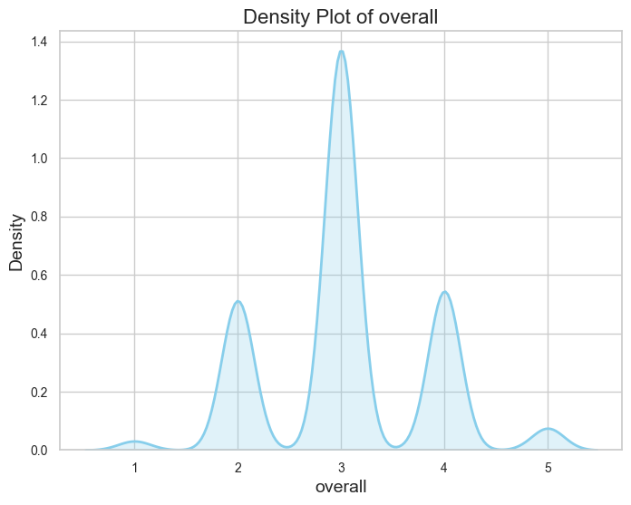
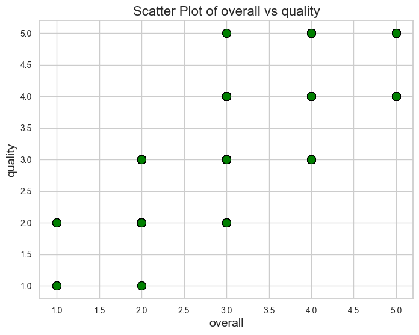
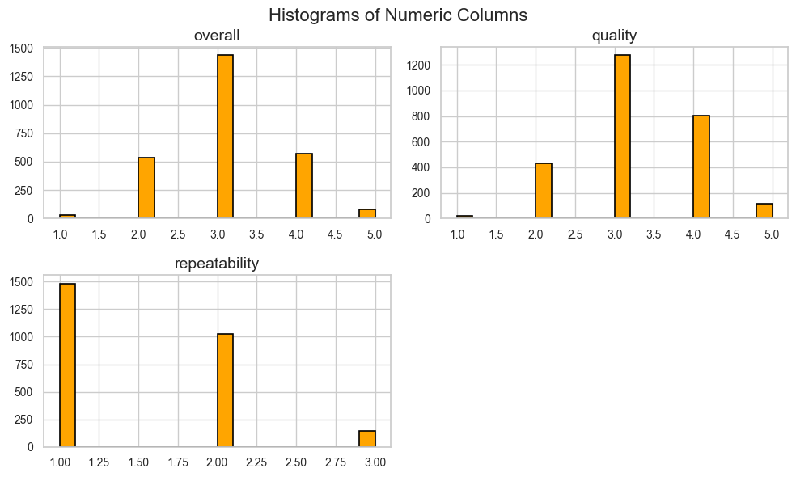
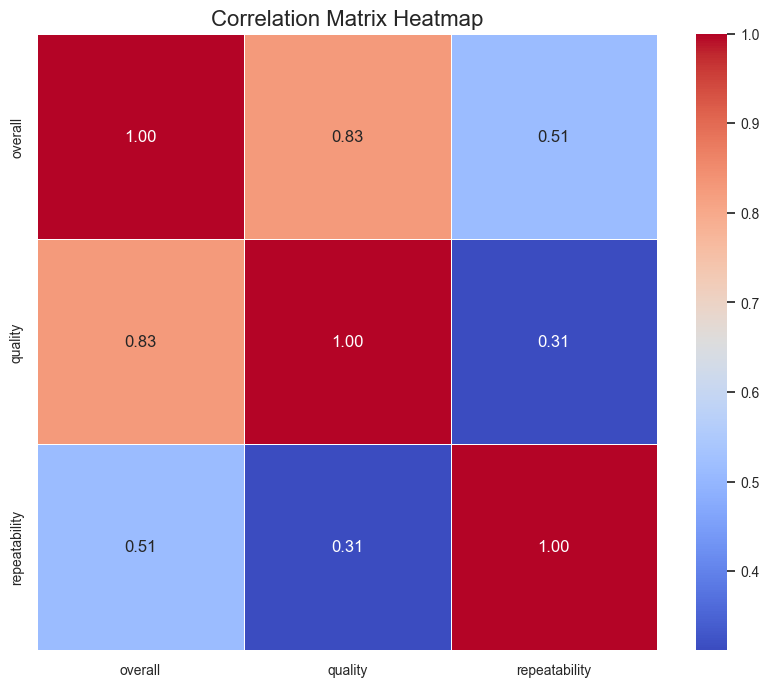

# Automated Data Analysis Report
This report presents a detailed analysis of the dataset, including descriptive statistics, data visualizations, and key insights.

## Insights from Dataset Analysis
Certainly! Below is a comprehensive analysis of the dataset based on the provided summary:

### 1. **Data Quality:**
**Missing Values:**
- **Columns with Missing Data:** 
  - **date**: 99 missing values (approximately 3.87% of the total entries).
  - **by**: 262 missing values (approximately 10.28% of the total entries).
- **Patterns in Missingness:**
  - The missingness in the **date** and **by** columns does not appear to be systematic but rather random. The **date** column might be due to data entry errors or missing records. The **by** column likely has missing values if the creators or contributors were not logged in or the fields were optional.
- **Suggestions for Handling Missing Data:**
  - For the **date** column, consider imputation using the average date or the most common date if contextually appropriate. If too many dates are missing, dropping this column might be considered.
  - The **by** column could also be imputed with the mode (most frequent value) or by using machine learning techniques if sufficient categorical predictors are available.
  - If the dataset is large, deleting rows with missing values, especially those in the **by** column, could be an option.

**Outliers:**
- No outliers were detected in the following columns: **overall**, **quality**, and **repeatability**. Thus, treating outliers in this dataset may not be necessary, reducing the risk of skewing meaningful insights.

**Data Types:**
- The types appear appropriate based on the analysis summary. However, a closer inspection of each column is necessary to ensure numerical values aren't stored as strings, especially for columns like **overall**, **quality**, and **repeatability**.

### 2. **Dataset Summary (Descriptive Statistics):**
- **Measures of Central Tendency**:
  - **Overall**: Mean = 3.05, Median = 3; suggests a central tendency around 3, indicating general quality perception.
  - **Quality**: Mean = 3.21, Median = 3; slightly higher average quality perception versus overall.
  - **Repeatability**: Mean = 1.49, Median = 1; indicates potential for categories with lower repeatability rates.
- **Spread Measures**:
  - Overall and quality show a relatively low standard deviation (0.76 and 0.80, respectively), confirming limited variation.
  - The width of interquartile ranges implies concentrated values - need to ensure no skew affects interpretation.
  
- **Categorical Analysis**:
  - The language column has 11 unique values, with **English** being predominant (1306 occurrences).
  - The **type** has 8 unique values, predominantly "movie" reflecting data collection biases.

**Statistical Insights**:
- Overall and quality scores might correlate (0.83), indicating a coherent quality perception among participants.
- The repeatability scores might need investigation due to their lower correlation with other variables, potentially reflecting measurement issues.

### 3. **Correlation Matrix:**
- **Variable Relationships**:
  - Strong positive correlation between **overall** and **quality** (0.83) indicates that higher quality ratings likely lead to higher overall ratings.
  - Moderate correlation between **overall** and **repeatability** (0.51) suggests a potential link where higher repeatability enhances perceived quality.
  
- **Unexpected Findings**:
  - **Quality** and **repeatability** show a relatively low correlation (0.31), which is surprising given their nature. It might imply that high quality doesn't always necessitate a repeatable product or vice-versa.

### 4. **Visualization Analysis:**
**Density Plot:**
- The density plot for the **overall** score would likely reveal a slight skewness if it leans towards higher values; skewness might require transformation (like log transformation) to stabilize variance.

**Scatter Plot:**
- The scatter plot examining *overall vs. quality* will likely show a positive linear trend, supporting the correlation matrix findings. Outliers, if they exist, could distort or hide true trends; thus, any inconsistency should be addressed.

**Histogram:**
- Review histograms for all numeric columns. If any column appears highly skewed or has gaps, consider transforming those columns or restructuring the bin sizes for improved visibility.

### 5. **Recommendations for Further Exploration and Data Cleaning:**
- **Further Exploration**:
  - Investigate the **repeatability** scores more closely to understand their predictors. 
  - Explore relationships involving other categorical variables (like *type* and *language*) to potentially enhance model effectiveness.

- **Data Cleaning**:
  - Handle missing values per above suggestions, impute when necessary, or drop if excessive.
  - Conduct conversions for any wrongly typed columns after further examination.
  
- **
## Visualizations

### 1. Density Plot
This plot shows the distribution of the first numeric column. It helps in understanding the shape of the distribution (e.g., normal, skewed, etc.).

### 2. Scatter Plot
This plot illustrates the relationship between the first two numeric columns. It can show if there is any correlation or a specific trend.

### 3. Histogram
This plot provides a view of the distribution of all numeric columns in the dataset. It is useful to identify data patterns such as skewness or outliers.

### 4. Correlation Heatmap
This heatmap visualizes the correlations between numeric columns in the dataset.

